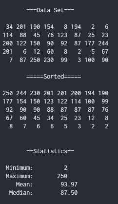

## Author: **Arturo Rivera**
## Date: **28/08/2022** 
---
 

## About the project

**Coursera:** Introduction to Embedded Systems 
University of Colorado **Boulder**

Application that performs statistical analytics on a data set to obtain its mean (average), median, maximum and minimum value.

Github: [C1M1-RIVERA](https://github.com/Arthurc21/C1M1-RIVERA)

---
 

## Output

